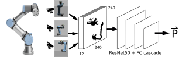
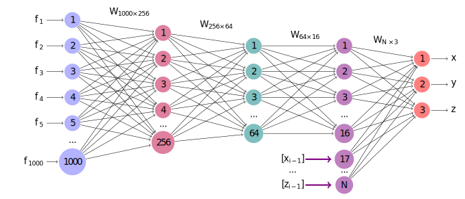
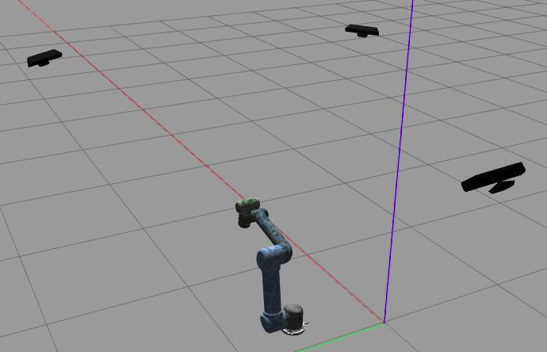
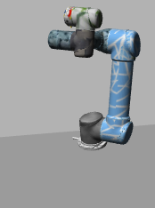
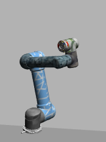
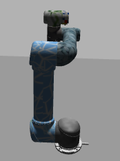
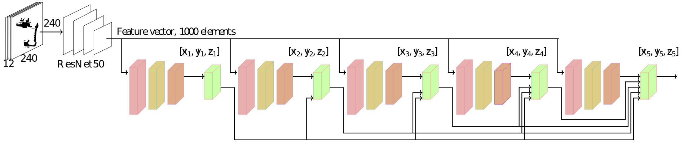
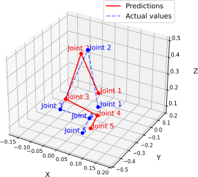

The project focuses on visual tracking of the UR5 using deep learning techniques. Three neural network models based on ResNet50 are evaluated. The database is obtained through ROS (Robot Operating System). This database comprises a total of 1170 records, each consisting of images captured by three different cameras.


#Proposed System



This proposed system involves the monitoring of a UR5 robotic arm, with captured images being labeled with position and orientation information. These labeled images then undergo a stacking process as illustrated in the figure, each having a resolution of 240 x 240 pixels with 12 channels, including depth information.

Subsequently, these processed images are fed through a ResNet50 neural network architecture, widely recognized for its effectiveness in computer vision tasks. In addition to ResNet50, fully connected layers are included, playing a crucial role in estimating the pose of the robotic arm.

Together, this system offers a comprehensive solution for the monitoring and control of the UR5 robotic arm, using labeled images and a powerful neural network to achieve precise estimation of its position and orientation.

#Fully Connected Block, 1000-256-64-16-3



The fully connected architecture is the one preceding this, which consequently concatenates the weights and adds them to the last hidden layer. In this figure, you can observe how the configuration works to ultimately obtain the pose vector.

#Simulation structure

<div align="center">
  
  
  
  
</div>

It's worth noting that the simulation framework enables the acquisition of images from different perspectives, aimed at gathering information from various positions. This data collection capability allows for the creation of a fully structured database, which will be used subsequently to train a model.

#Structured database.

The database comprises images, timestamps, pose information, and an identification number. These are the essential data required for the implementation of the cascaded neural network model.

Please refer to the structured database table.

| Example | TimeStamp | Cam1 | Cam2 | Cam3 | Position (x, y, z) | Orientation (ψ, θ, φ) | Joints (q1..q6) |
|---------|-----------|------|------|------|---------------------|------------------------|------------------|
|         | $\vdots$  |      |      |      |                     |                        |                  |
| $i$     | $t_{i}$   | Img1${i}$ | Img2${i}$ | Img3${i}$ | $[x, y, z]_{i}$ | $[ψ, θ, φ]_{i}$ | $[q1..q6]_{i}$ |
|         | $\vdots$  |      |      |      |                     |                        |                  |

#Complete cascade architecture


Given that we experimented with three models, the best results were achieved with the full cascade architecture. The structures of these models are as follows:

##Casacade
The cascade simply gathers information from previous estimates.

##Cascade Complete
The complete cascade gathers previous information and concatenates it for subsequent estimation.

##Full Conneted Structure
Interprets the features and makes final predictions.

- **Input:** 1000 element feature vector.
- **Output:** Joint coordinates \(x, y, z\).

This is what is observed in the image.


#Results

The results of this project showed a mean squared error (MSE) of approximately (0.02m)^2 as a measure of accuracy. MSE is a commonly used criterion to assess the quality of estimates in regression problems, where it quantifies the squared difference between estimated values and true values. In this case, an MSE of (0.02m)^2 indicates that, on average, the estimates deviated by this squared amount.

<div align="center" style="border: 1px solid black; padding: 10px;">
  
  
</div>

#Repository Structure and Contents.
## Repositorio: "Pose Estimation of Robot End-Effector using a CNN-Based Cascade Estimator"

## 1. Clonación del Repositorio

Para clonar el repositorio, ejecuta el siguiente comando en tu terminal:

```bash
git clone https://github.com/nombre_usuario/nombre_repositorio.git 
```


## Paso 2: Instalación de ROS Noetic
### Sigue las instrucciones en la página oficial de ROS: http://wiki.ros.org/noetic/Installation

## Paso 3: Creación de un Espacio de Trabajo de ROS
mkdir -p ~/catkin_ws/src
cd ~/catkin_ws/
catkin_make
source devel/setup.bash

## Paso 4: Instalación de Dependencias
cd ~/catkin_ws/src
git clone https://github.com/nombre_usuario/otro_repositorio.git
rosdep install --from-paths . --ignore-src -r -y

## Paso 5: Compilación del Código
cd ~/catkin_ws/
catkin_make
source devel/setup.bash

## Paso 6: Configuración de ROS
source ~/catkin_ws/devel/setup.bash

## Paso 7: Ejecución del Código
roslaunch nombre_paquete nombre_archivo.launch

##Como citar este documento.
@INPROCEEDINGS{10333441,
  author={Ortega, Kevin D. and Sepúlveda, Jorge I. and Hernandez, Byron and Holguín, German A. and Medeiros, Henry},
  booktitle={2023 IEEE 6th Colombian Conference on Automatic Control (CCAC)}, 
  title={Pose Estimation of Robot End-Effector using a CNN-Based Cascade Estimator}, 
  year={2023},
  volume={},
  number={},
  pages={1-6},
  doi={10.1109/CCAC58200.2023.10333441}}